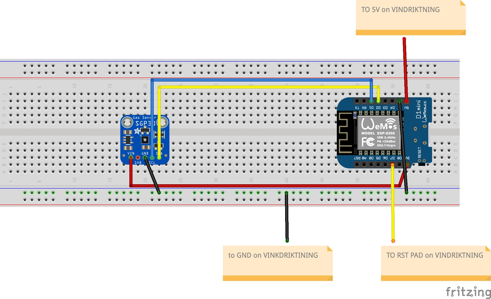

# VINDRIKTNING project extension

## Project to add an Adafruit SGP30 CO2 and VOC sensor to the PM25 sensor in the IKEA VINDRIKTNING and have it all report to MQTT

This project, like so many, came out of necessity.  Earlier this month when I was working on my MeArm project I initially tried cutting the pieces from 3mm acrylic using the 10W laser cutter on my Snapmaker.  While small test cuts of acrylic went well, what I soon discovered is that once you get beyond a few simple lines to try to cut anything complicated, especially multiple complicated things, that the fumes from the vaporized acrylic become overpowering.  This is despite the fact that my laser cutter is in an enclosure that vents to the outside.

What I had to do is to add both an air purifier and an additional venting fan to the room where I keep the Snapmaker.  However, even with this, it's kind of hit and miss as to how bad the smell will be (or it's anyone's guess as to how potentially damaging extended exposure to the fumes would be) whenever I use the cutter.  So what I wanted was a way of gauging the air quality in the room without opening the door to the room, knowing that given enough time that the air purifier and vent fan(s) will eventually clear the air.   

In our kitchen, I have an air quality meter already - a commercial model from Awair, the [Awair Element](https://www.getawair.com/products/element) which has all the features I want - it measures CO2, particulate matter and Volatile Organic Compounds (VOC's).  It's also integrated into Apple Homekit, which is the home automation ecosystem that I use.

The problem with the Awair Element is that the thing costs $300.  I really didn't want to spend the same amount on another one.  That's when serendipity struck.  The first thing is that I randomly came again across a wonderful hack that I had seen earlier on Hackaday where Soren Byren had taken a cheap ($13 USD) IKEA [VINDRITKTNING](https://www.ikea.com/us/en/p/vindriktning-air-quality-sensor-60515911/) air quality sensor and added another cheap ($5 USD or less in quantity) ESP8266 board to enable it for the Internet of Things. I thought it was cool when I first saw it, but when I went back to it, I noticed that the IKEA sensor only measured one quantity, PM2.5 (small particulate matter). However, while browsing on Adafruit to see if they had anything that could measure air quality I came across another cheap sensor, the [SGP30](https://www.adafruit.com/product/3709) ($17.50 USD), which measured both CO2 and VOC density.

That's the combination I was looking for!  And what's more, the total price of less than $50USD for all the parts fit my budget.  With a little research, I figured out that the two sensors could theoretically work together, since the original VINDRIKTNING hack used only one UART pin on the 8266 board, and the SGP30 used SCA/SDL instead (which are only two pins).  A bit of reading of specs also led me to my final piece, the ESP8266 board to use.  

In the original version of the hack (which is now a few years old) they used an older ESP3866 NodeMCU development board, which, while tiny compared to the original Arduino or a Raspberry Pi, is still sizeable when you're trying to fit it into the small space that remains inside the VINDRIKTNING case. I soon determined that while the original board would fit, it would not leave anough room for the SGP30.  However, in the meantime, smaller boards like the [D1 Mini](https://www.amazon.com/dp/B073CQVFLK) have been developed, which give you a smaller set of pins in a smaller form factor, but which contain enough pins to let me built the circuit I wanted.  

In the end that led me to the circuit below.  

Once I figured out the circuit and the pinouts, I had to slightly modify the original C++ code in the VINDRIKTNING project in a couple of ways:

1. I had to change the original UART pinout numbers to match the GPIO numbers of the pins used in the new circuit
2. I had to add to the original code to add the functionality to read the SGP30 and report the CO2 and VOC results on MQTT along with the particulate numbers.

Once I started in on the modifications, I immediately felt bad - the original code was a very well written piece of C++ that was a step above most Arduino sketches, including nice use of namespaces and object oriented principles.  I felt almost dirty in the way I hacked it up by adding in global variables (ick!) to store the VOC and CO2 results.  At some point I may return and try to clean it up, but at this point the code functions.

The project as it is now will automatically function with the HomeAssistant open-source home automation ecosystem.

One additional feature I had to add ties into the next part of this project - enabling this for Apple's Homekit.  I already use the wonderful open source Homebridge project to tie together all of my various Internet of Things bits in my house together.  It is, for instance, WAY better at managing the Wemo switches and outlets that I have than the Wemo application.  What I found is that there is a plugin for Homebridge that allows you to connect devices that communicate via MQTT to Homekit - that is the [MQTT-Thing plugin](https://github.com/arachnetech/homebridge-mqttthing) from David Miller.  This page shows you the configuration to make that work.
