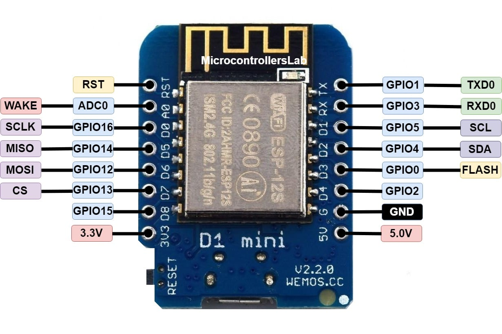

# VINDRIKTNING project extension

## Adding an Adafruit SGP30 CO2 and VOC sensor to the PM25 sensor in the IKEA VINDRIKTNING and have it all report to MQTT

This project, like so many, came out of necessity.  Earlier this month while I was working on my [MeArm project](https://github.com/kgb1001001/MeArmSoftware) I initially tried cutting the pieces from 3mm acrylic using the 10W laser cutter on my [Snapmaker](https://snapmaker.com/).  While small test cuts of acrylic went well, what I soon discovered is that once you get beyond a few simple lines to try to cut anything complicated, especially multiple complicated things at once, that the fumes from the vaporized acrylic become overpowering.  This is despite the fact that my laser cutter is in an enclosure that vents to the outside.

I ended up adding both an air purifier and an additional venting fan to the room where I keep the Snapmaker.  However, even with this, it's kind of hit and miss as to how bad the smell will be (and it's anyone's guess as to how potentially damaging extended exposure to the fumes would be) whenever I use the cutter.  So what I wanted was a way of gauging the air quality in the room without opening the door to the room, knowing that given enough time that the air purifier and vent fan(s) will eventually clear the air.   

In our kitchen, I have an air quality meter already - a commercial model from Awair, the [Awair Element](https://www.getawair.com/products/element) which has all the features I want - it measures CO2, particulate matter and Volatile Organic Compounds (VOC's).  It's also integrated into Apple Homekit, which is the home automation ecosystem that I use.

The problem with the Awair Element is that the thing costs $300.  I really didn't want to spend the same amount on another one.  That's when serendipity struck.  The first thing is that I randomly came again across a [wonderful hack](https://github.com/Hypfer/esp8266-vindriktning-particle-sensor) that I had seen earlier on Hackaday where Soren Byren had taken a cheap ($13 USD) IKEA [VINDRITKTNING](https://www.ikea.com/us/en/p/vindriktning-air-quality-sensor-60515911/) air quality sensor and added another cheap ($5 USD or less in quantity) ESP8266 board to enable it for the Internet of Things. I thought it was cool when I first saw it, but when I went back to it, I noticed that the IKEA sensor only measured one quantity, PM2.5 (small particulate matter). However, while browsing on Adafruit to see if they had anything that could measure air quality I came across another cheap sensor, the [SGP30](https://www.adafruit.com/product/3709) ($17.50 USD), which measured both CO2 and VOC density.

That's the combination I was looking for!  And what's more, the total price of less than $50USD for all the parts fit my budget.  With a little research, I figured out that the two sensors could theoretically work together, since the original VINDRIKTNING hack used only one UART pin on the 8266 board, and the SGP30 used SCL/SDA instead (which are only two pins).  

I had to change things around a bit since the original hack used one of the two pins that are needed for SDA/SCL. In the end that led me to the circuit below.  

I'll not walk you through the detailed soldering instructions the way that the original project did - I'm guessing if you're getting this far you can figure out how to extend the instructions they gave you to add soldering the additional pins to wire in the SGP30.

Once I figured out the circuit and the pinouts, I had to slightly modify the original C++ code in the VINDRIKTNING project in a couple of ways:

1. I had to change the original UART pinout number to match the GPIO number of the pin used in the new circuit (GPIO 13, or D7).  As mentioned above the original hack had used D2 for the UART connection to the VINDRIKTNING but I needed D2 because it's also the predefined SDA pin.   The pinouts of the D1 Mini are below:

2. I had to add to the original code to add the functionality to read the SGP30 and report the CO2 and VOC results on MQTT along with the particulate numbers.

Once I started in on the modifications, I immediately felt bad - the original code was a very well written piece of C++ that was a step above most Arduino sketches, including nice use of namespaces and object oriented principles.  I felt almost dirty in the way I hacked it up by adding in global variables (ick!) to store the VOC and CO2 results.  At some point I may return and try to clean it up, but at this point the code functions and that's enough.  Heck, if I find enough time later, I may pay the team back by writing a test suite. 

The project as it is now will automatically function with the [HomeAssistant](https://www.home-assistant.io/) open-source home automation ecosystem.

One additional feature I had to add ties into the next part of this project - enabling this for Apple's Homekit.  I already use the wonderful open source [Homebridge](https://homebridge.io/) project to tie together all of my various Internet of Things bits in my house together.  It is, for instance, WAY better at managing the Wemo switches and outlets that I have than the Wemo application.  What I found is that there is a plugin for Homebridge that allows you to connect devices that communicate via MQTT to Homekit - that is the [MQTT-Thing plugin](https://github.com/arachnetech/homebridge-mqttthing) from David Miller.  [This page](homebridge-config.md) shows you the configuration to make that work.

# Software

Using this software is pretty straightforward, almost all of the build instructions can be found on the original project.  To repeat a bit of that here, with a few important changes.

1. Download the latest Arduino IDE and add the following libraries using the Library Manager

  
    - ArduinoOTA 1.0.3
    - ArduinoJSON 6.10.1
    - PubSubClient 2.8.0
    - WiFiManager 0.15.0
    - Adafruit SGP30 Sensor 2.0.0
    
2. Open the Preferences window in the Arduino IDE.  Navigate to the Additional Boards Manager URLs field. Enter http://arduino.esp8266.com/stable/package_esp8266com_index.json (You can add multiple URLs, separating them with commas.).  Quit the Arduino IDE and reopen it.

4. Open the Boards Manager and install "esp8266 by ESP8266 Community".  Select the NodeMCU 1.0 version.
    
3. Clone this repository and Open the esp8266-vindriktning-particle-sensor-sgp30.ino file in the Arduino IDE.  Ensure that you do NOT have the USB Cable plugged into the VINDRIKTNING.  Instead, plug the USB cable into the D1 Mini so that you can upload the Arduino sketch.  After plugging in the USB cable, choose the USB port for your board and upload the sketch.

4. Unplug the USB cable from the ESP8266 board and then insert the SGP30 and D1 Mini (along with all of the wires) into the VINDRIKTNING case. After it's reassembled, then plug the USB cable into the VINDRIKTNING and watch for the air sensor LED's to cycle through and finally settle on Green or yellow (Depending upon the air quality in the room you are in).  At this point, you can move on to configuration of the Wifi and MQTT.

